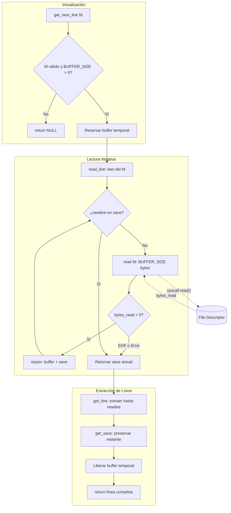

# Get Next Line


---

## 📝 Descripción

Implementación en C de una función que lee líneas completas desde un file descriptor, manejando eficientemente buffers de tamaño configurable. El proyecto demuestra dominio de memoria dinámica, variables estáticas y manipulación de strings a bajo nivel—habilidades fundamentales para el desarrollo de sistemas.

---

## ✨ Características Principales

- **Lectura línea a línea**: Devuelve cada línea completa incluyendo el carácter `\n` si existe
- **Buffer configurable**: Tamaño de buffer definible en compilación mediante `BUFFER_SIZE`
- **Gestión de memoria eficiente**: Libera automáticamente los recursos tras cada llamada
- **Manejo robusto de errores**: Gestiona EOF, archivos vacíos y errores de lectura
- **Multi-descriptor (Bonus)**: Soporte para leer simultáneamente de múltiples file descriptors
- **Implementación sin dependencias externas**: Utiliza solo funciones de la biblioteca estándar de C

---

## 🛠 Stack Tecnológico

| Categoría | Tecnología |
|-----------|------------|
| Lenguaje | C (C99) |
| Compilación | GCC / Clang |
| Sistema Operativo | Linux / macOS |
| Librerías | `<stdlib.h>`, `<unistd.h>`, `<stddef.h>` |
| Estilo de Código | Norminette 42 |

---

## 🏗 Decisiones Técnicas / Arquitectura

La función `get_next_line` resuelve el desafío de leer archivos de forma incremental sin cargar todo el contenido en memoria. Utiliza una **variable estática** para preservar el estado del buffer entre llamadas consecutivas, almacenando los caracteres que sobrepasan la línea actual hasta la siguiente invocación.

Esta arquitectura resuelve el problema fundamental de alinear discontinuidades entre el tamaño del buffer y las líneas del archivo. La separación entre funciones de lectura (`read_line`) y extracción (`get_line`, `get_save`) aplica el principio de responsabilidad única.

En la **versión bonus**, el diseño se extiende con un array de punteros estáticos indexados por file descriptor (`static char *save[FOPEN_MAX]`), permitiendo gestionar múltiples archivos abiertos simultáneamente sin interferencia entre ellos. El `BUFFER_SIZE` por defecto de 512 bytes equilibra el overhead de syscalls con el uso de memoria.

---

## 📊 Diagrama de Arquitectura



---

## 🚀 Guía de Instalación

### Prerrequisitos

- GCC o Clang instalado
- Sistema operativo UNIX/Linux/macOS

### Instalación

```bash
# Clonar el repositorio
git clone https://github.com/samuelhm/GetNextLine.git
cd GetNextLine
```

### Compilación

```bash
# Versión mandatory
gcc -Wall -Wextra -Werror -D BUFFER_SIZE=42 get_next_line.c get_next_line_utils.c -o gnl

# Versión bonus (multi-descriptor)
gcc -Wall -Wextra -Werror -D BUFFER_SIZE=42 get_next_line_bonus.c get_next_line_utils_bonus.c -o gnl_bonus
```

### Ejemplo de Uso

```c
#include "get_next_line.h"
#include <fcntl.h>
#include <stdio.h>

int main(void)
{
    int fd = open("archivo.txt", O_RDONLY);
    char *line;

    while ((line = get_next_line(fd)) != NULL)
    {
        printf("%s", line);
        free(line);
    }
    close(fd);
    return (0);
}
```

---

## 📁 Estructura del Proyecto

```
GetNextLine/
├── get_next_line.c              # Implementación principal
├── get_next_line.h              # Header principal
├── get_next_line_utils.c        # Funciones auxiliares
├── get_next_line_bonus.c        # Implementación multi-fd
├── get_next_line_bonus.h        # Header versión bonus
└── get_next_line_utils_bonus.c  # Utilidades versión bonus
```

---

## 📩 Contacto

| Plataforma | Enlace |
|------------|--------|
| **GitHub** | [github.com/samuelhm](https://github.com/samuelhm/) |
| **LinkedIn** | [linkedin.com/in/shurtado-m](https://www.linkedin.com/in/shurtado-m/) |

---

<p align="center"><i>Desarrollado como parte del currículum de 42 Barcelona</i></p>