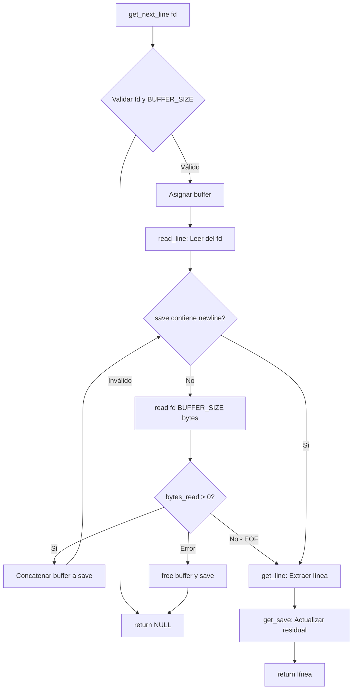

# Get Next Line

[](https://en.wikipedia.org/wiki/C_(programming_language))
[, Status (Completed), 42 School, Norminette, y badges de habilidades (Memory Management, File Descriptors, Static Variables, Algorithm Design)
- **Descripción**: Elevator pitch de2-3 líneas
- **Características**: 6 puntos clave derivados del código
- **Stack Tecnológico**: Tabla con tecnologías
- **Decisiones Técnicas**: Párrafo profesional explicando la arquitectura basada en variables estáticasy el diseño
- **Diagrama Mermaid**: Flowchart estrecho del flujo dela función
- **Instalación**: Comandos secuenciales para clonar, compilar y usar
- **Contacto**: Links a GitHub y LinkedIn
.shields.io/badge/Concept-Static_Variables-9cf?style=flat-square)](https://en.wikipedia.org/wiki/Static_variable)
[](https://en.wikipedia.org/wiki/Algorithm_design)

## Descripción

Implementación en C de una función que lee líneas completas desde un file descriptor, manejando eficientemente buffers de tamaño configurable. El proyecto demuestra dominio de memoria dinámica, variables estáticas y manipulación de strings a bajo nivel—habilidades fundamentales para el desarrollo de sistemas.

## Características Principales

- Lectura eficiente línea por línea desde cualquier file descriptor
- Gestión de memoria dinámica con liberación correcta de recursos
- Soporte para BUFFERS de tamaño configurable (por defecto: 512 bytes)
- **Versión Bonus**: Manejo concurrente de múltiples file descriptors
- Implementación propia de funciones de utilidad (`ft_strlen`, `ft_strjoin`, `ft_strdup`, `ft_substr`, `ft_strchr`)
- Manejo robusto de errores y casos edge (EOF, archivos vacíos, errores de lectura)

## Stack Tecnológico

| Categoría | Tecnología |
|-----------|------------|
| Lenguaje | C (C99) |
| Compilación | GCC / Clang |
| Sistema Operativo | Linux / macOS |
| Estilo de Código | Norminette 42 |

## Decisiones Técnicas y Arquitectura

La arquitectura se basa en el uso estratégico de **variables estáticas** para preservar el estado del buffer entre llamadas consecutivas, permitiendo que la función retorne líneas completas incluso cuando el salto de línea no coincide con el límite del buffer. Esta decisión resuelve el desafío fundamental de alinear discontinuidades entre el tamaño del buffer y las líneas del archivo.

Se implementó una separación entre funciones de lectura (`read_line`) y extracción de líneas (`get_line`, `get_save`), aplicando el principio de responsabilidad única. La versión bonus extiende esta arquitectura utilizando un array estático de punteros indexado por file descriptor, permitiendo gestionar múltiples archivos abiertos simultáneamente sin interferencia entre estados.

El BUFFER_SIZE por defecto de 512 bytes equilibra el overhead de syscalls con el uso de memoria, siendo configurable en tiempo de compilación mediante `-D BUFFER_SIZE=n`.

## Diagrama de Flujo



## Instalación y Uso

### Clonar el repositorio

```bash
git clone https://github.com/samuelhm/GetNextLine.git
cd GetNextLine
```

### Compilar con tu programa

```bash
# Compilar versión mandatory
gcc -Wall -Wextra -Werror get_next_line.c get_next_line_utils.c main.c -o program

# Compilar versión bonus (múltiples fd)
gcc -Wall -Wextra -Werror -D BUFFER_SIZE=42 get_next_line_bonus.c get_next_line_utils_bonus.c main.c -o program_bonus
```

### Ejemplo de uso

```c
#include "get_next_line.h"
#include <fcntl.h>
#include <stdio.h>

int main(void)
{
    int     fd;
    char    *line;

    fd = open("archivo.txt", O_RDONLY);
    while ((line = get_next_line(fd)) != NULL)
    {
        printf("%s\n", line);
        free(line);
    }
    close(fd);
    return (0);
}
```

## Estructura del Proyecto

```
GetNextLine/
├── get_next_line.c           # Implementación mandatory
├── get_next_line.h           # Header mandatory
├── get_next_line_utils.c     # Utilidades mandatory
├── get_next_line_bonus.c     # Implementación bonus (múltiples fd)
├── get_next_line_bonus.h     # Header bonus
├── get_next_line_utils_bonus.c # Utilidades bonus
└── README.md
```

## Aprendizajes Clave

- Dominio de **variables estáticas** y su persistencia en el call stack
- Gestión manual de memoria dinámica en C (`malloc`/`free`)
- Manipulación de **file descriptors** y syscalls UNIX (`read`, `open`, `close`)
- Diseño de algoritmos eficientes para buffering de E/S
- Aplicación de buenas prácticas de manejo de errores
- Cumplimiento de estándares de código (Norminette 42)

---

## Contacto

**Samuel Hurtado Martínez**

[](https://github.com/samuelhm/)
[](https://www.linkedin.com/in/shurtado-m/)

---
*Desarrollado como parte del currículo de 42 Barcelona*